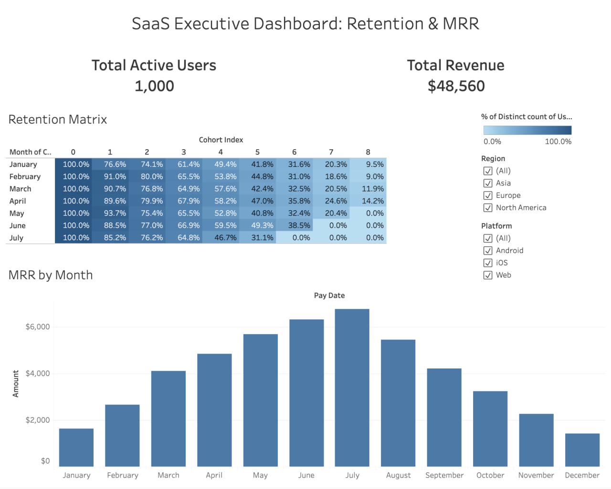

# SaaS Executive Dashboard: Retention & MRR Analysis

## 📌 Project Overview

This project provides a full-cycle analytical solution for a subscription-based SaaS business. It covers everything from raw data generation to advanced SQL transformations and interactive business intelligence visualization.

**Live Dashboard:** [Link to Tableau Public](https://public.tableau.com/views/SaaSCohortRetentionAnalysis/Dashboard1?:language=en-US&:sid=&:redirect=auth&:display_count=n&:origin=viz_share_link)

## 🛠️ Tech Stack

* **Python (Pandas):** To generate a synthetic dataset of 1,000+ users with realistic subscription lifecycles.
* **SQL:** To perform cohort analysis using **Window Functions** and complex joins.
* **Tableau:** To design an executive-level interactive dashboard.

## 📊 Business Metrics Analyzed

1. **Month-over-Month Retention:** Tracking user stickiness via a Cohort Heatmap.
2. **Monthly Recurring Revenue (MRR):** Analyzing financial growth and seasonality.
3. **User Segmentation:** Filtering performance by **Region** and **Platform** (iOS, Android, Web).

## 🚀 Key Features

* **Automated Data Preparation:** Script generates random but logical user behavior (registration dates, payment cycles, churn).
* **Cohort Logic:** SQL queries calculate the `Cohort Index` by determining the first payment date for every user using `MIN() OVER(PARTITION BY...)`.
* **Interactive UI:** Users can deep-dive into specific segments to identify which cohorts have the highest churn risk.

## 📂 Project Structure

* `script.py` — Python script for data synthesis.
* `queries.sql` — SQL script with cohort calculation logic.
* `tableau_data.csv` — The final processed dataset used for Tableau.
